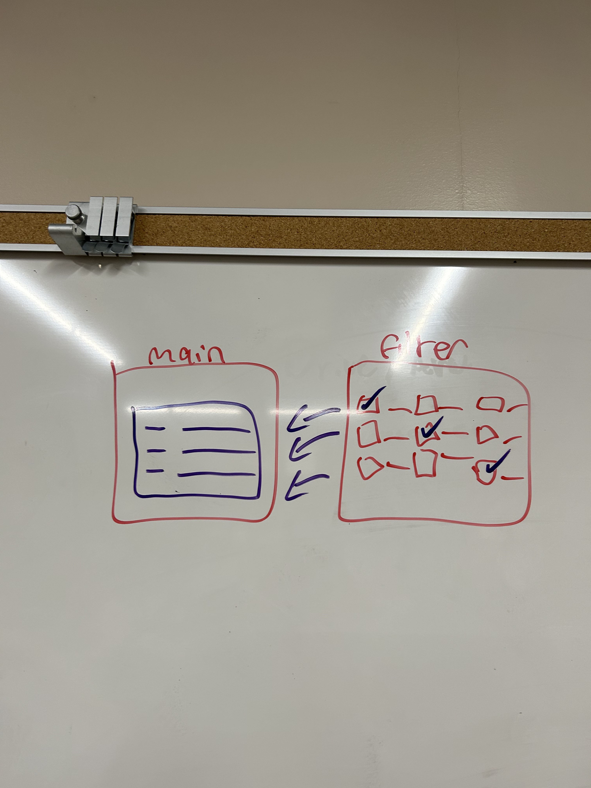
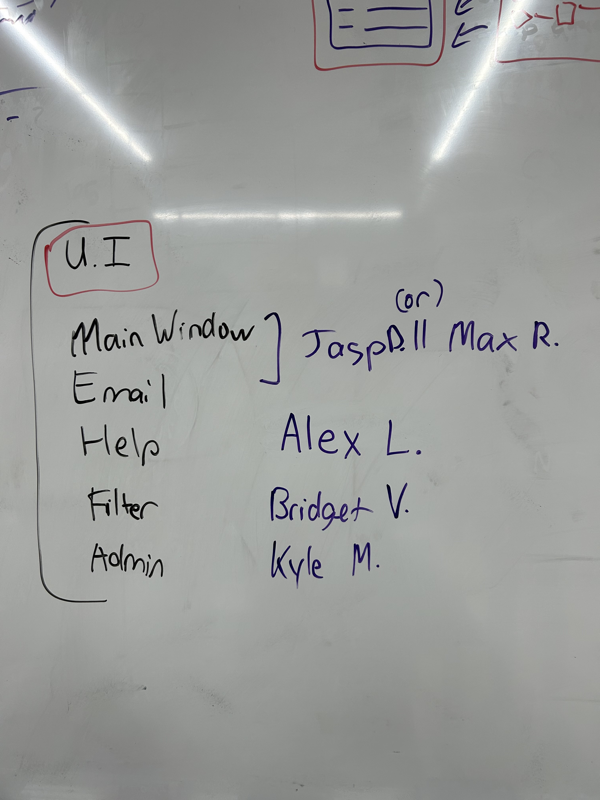
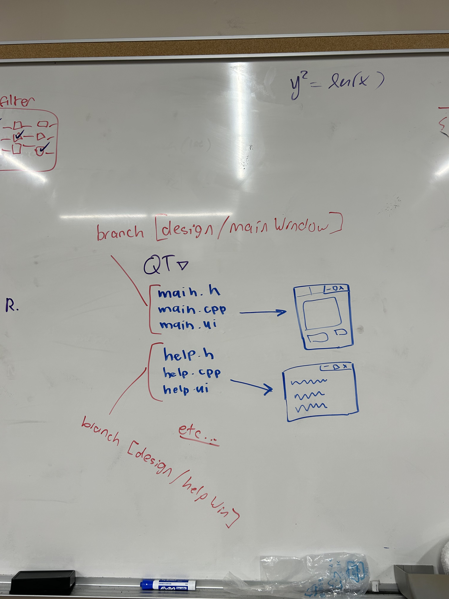

# 10/24/2022
- FILTER

- how the filter ui/window would interact with main.
- You are able to filter certain parts/details that you want to show up. This will filter the results in main. 

- TASKS:

- Assigned different windows to develop for the UI. 
- Each UI will be created by a group member and how each UI interacts with main will be discussed further down the line. 
    + Filter UI - @bridget127
    + Main UI - @wluxie || @max9001
    + Email UI - @wluxie || @max9001
    + Admin UI - @Alee232
    + Email UI - @snappyappleTheSimple

- BRANCHING:

- Discussed splitting up the different UI windows.
- When creating different UI pages (help, email, login, etc), they are their own separate branches that will be implemented all together into main. 
    + This will allow for each UI to be developed separately and then merged into main.
    + For instance, help UI will be developed on `design/helpWindow` branch. Once the UI is complete, it will be merged into `main` branch.